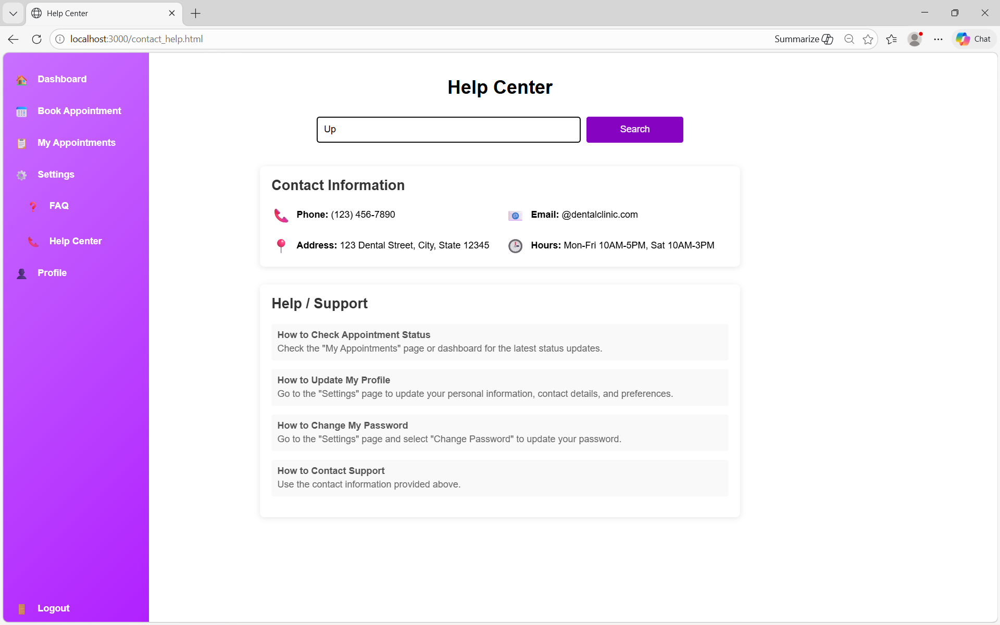
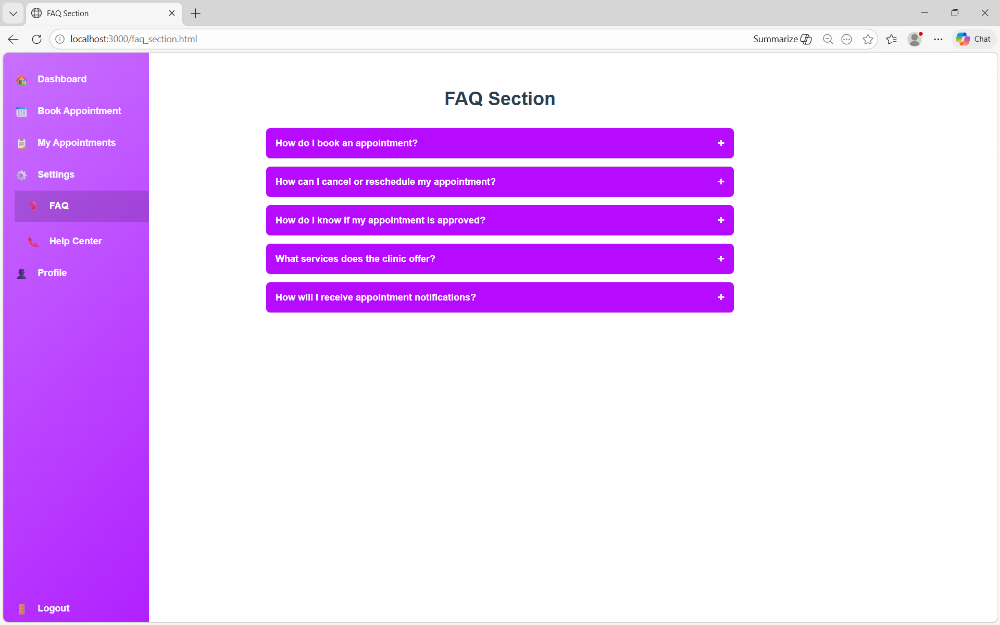
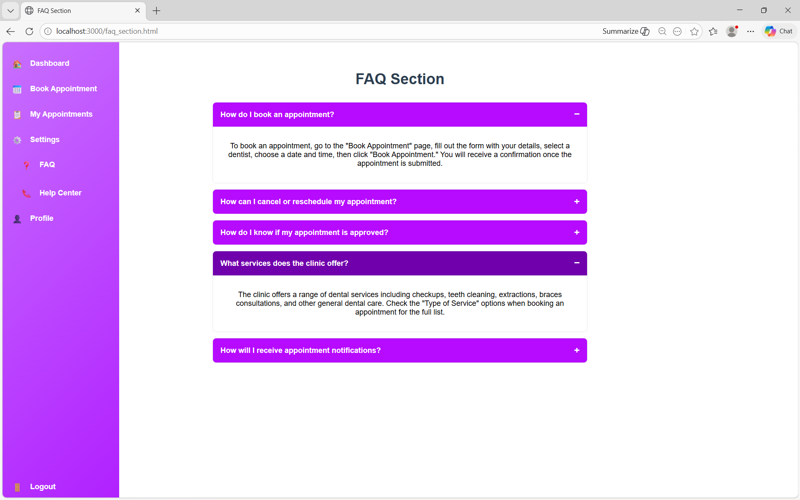

DENTAL CLINIC APPOINTMENT SYSTEM
FEATURE IMPLEMENTATION README

---

## FEATURE 1: FAQ SECTION

Mini Specs:
The FAQ Section provides answers to common questions that patients may have about booking appointments, cancelling or rescheduling appointments, checking appointment status, clinic services, and receiving notifications. The feature uses an accordion-style layout where users can click a question to reveal the answer.

What I Implemented:
I implemented an FAQ page that contains multiple frequently asked questions related to the dental appointment system. Each question expands when clicked, allowing the user to view the corresponding answer. The design follows the purple gradient theme of the application and includes collapsible sections for better readability.

Problems / Challenges Encountered:
One challenge I encountered was implementing the accordion functionality so that the answers would expand and collapse properly. I also had to ensure that the layout remained responsive and visually consistent with the rest of the system interface.

---

## FEATURE 2: CONTACT / HELP PAGE

Mini Specs:
The Contact/Help Page provides users with support information and guidance for using the system. It includes clinic contact details such as phone number, email address, physical address, and clinic hours. The page also includes a search bar and help topics to assist users in finding answers quickly.

What I Implemented:
I implemented a Help Center page that displays the clinic’s contact information and a list of help/support guides. The guides explain how to perform common tasks such as booking an appointment, cancelling or rescheduling appointments, checking appointment status, updating profile information, and contacting support.

Problems / Challenges Encountered:
One difficulty was organizing the help topics so they would be easy for users to understand and navigate. I also had to ensure the layout aligned with the design of the other pages in the system and that the search bar and information sections were clearly displayed.

  .png>)  .png>)
